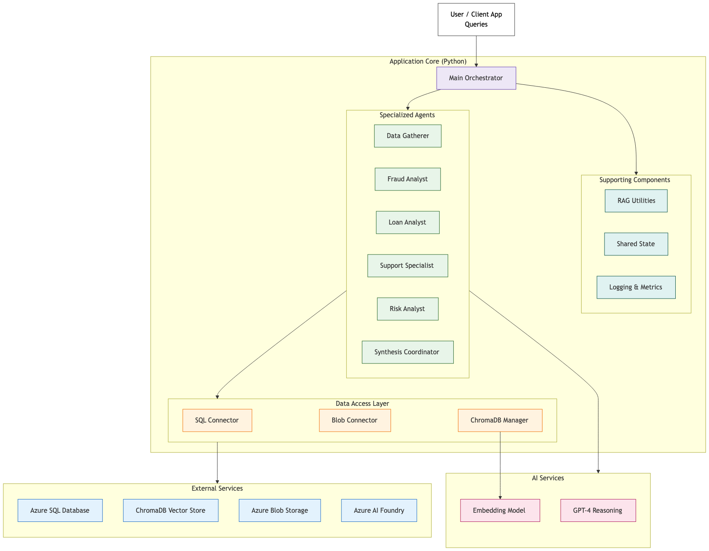
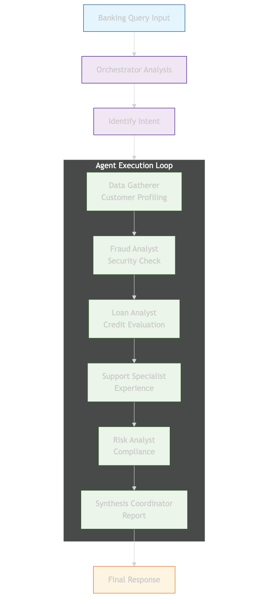
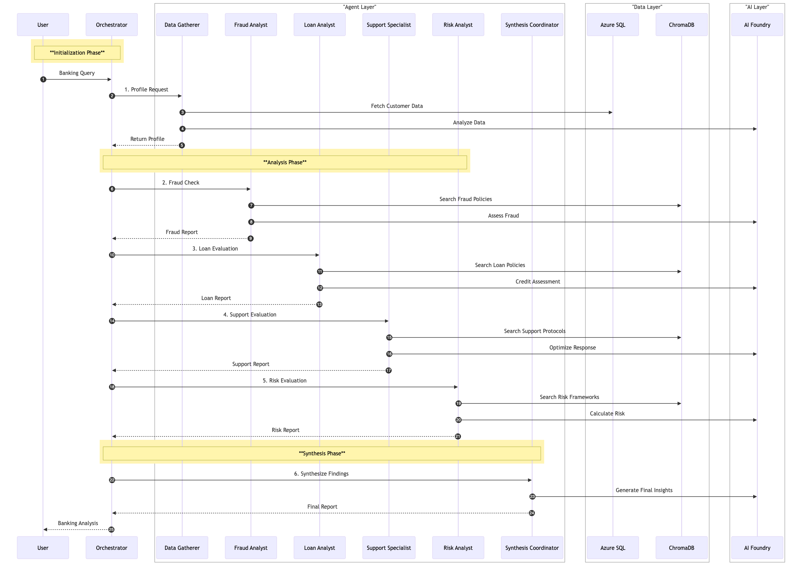

# VectraBank: Agentic RAG for Banking

A multi-agent AI system for comprehensive banking analysis, built with Microsoft Semantic Kernel and Retrieval Augmented Generation (RAG). The system orchestrates six specialized agents to process customer queries across fraud detection, loan eligibility, customer support, risk assessment, and strategic planning.

---

## System Architecture

The system follows a layered architecture connecting user queries through a central orchestrator to specialized agents, data services, and AI models.



**Key layers:**
- **Application Core** -- Main orchestrator (`main_starter.py`) manages the workflow
- **Specialized Agents** -- Six domain-expert agents powered by Azure AI Foundry (GPT-4.1)
- **Data Access Layer** -- SQL Connector, Blob Connector, and ChromaDB Manager
- **External Services** -- Azure SQL Database, Azure Blob Storage, ChromaDB Vector Store, Azure AI Foundry

---

## Agent Orchestration

Agents execute in a sequential pipeline using Semantic Kernel's `SequentialOrchestration`. Each agent builds on the previous agent's output, culminating in a synthesized executive report.



| # | Agent | Role |
|---|-------|------|
| 1 | **Data Gatherer** | Customer profiling, financial metrics, policy matching |
| 2 | **Fraud Analyst** | Transaction pattern analysis, suspicious activity detection |
| 3 | **Loan Analyst** | Credit risk evaluation, eligibility determination |
| 4 | **Support Specialist** | Customer experience assessment, retention strategies |
| 5 | **Risk Analyst** | Multi-dimensional risk scoring, compliance verification |
| 6 | **Synthesis Coordinator** | Executive report generation, strategic recommendations |

---

## Data Flow

The sequence diagram below shows the complete data flow from user query to final report, including interactions with Azure SQL, ChromaDB, and Azure AI Foundry.



**Three phases:**
1. **Initialization** -- Load customer profile from Azure SQL, fetch transaction data
2. **Analysis** -- Each agent queries ChromaDB for relevant policies and calls Azure AI Foundry for reasoning
3. **Synthesis** -- Coordinator integrates all findings into a structured `EnhancedBankingReport`

---

## Project Structure

```
VectraBank-AgenticRAG-for-Banking/
|-- main_starter.py          # Main orchestration engine + CLI entry point
|-- blob_connector.py        # Document storage (local simulation of Azure Blob)
|-- chroma_manager.py        # ChromaDB vector database manager (6 collections)
|-- rag_utils.py             # PDF/DOCX/TXT reading, chunking, policy extraction
|-- shared_state.py          # Thread-safe state management between agents
|-- create.sql               # Azure SQL table definitions
|-- insert.sql               # Sample customer and transaction data
|-- query.sql                # Example queries
|-- pyproject.toml           # Dependencies and project metadata
|-- .env                     # Azure credentials (not committed)
|-- REFLECTION_REPORT.md     # Architecture reflection and challenges
|-- static/
|   |-- architecture.png     # System architecture diagram
|   |-- agentorchesstration.png  # Agent orchestration flow
|   |-- dataflow.png         # Sequence diagram
```

---

## Tech Stack

| Component | Technology |
|-----------|-----------|
| Agent Framework | Microsoft Semantic Kernel (`SequentialOrchestration`) |
| LLM | Azure AI Foundry -- GPT-4.1 |
| Embeddings | Azure text-embedding-3-small |
| Vector Database | ChromaDB (6 banking-specific collections) |
| Relational Database | Azure SQL Database |
| Document Storage | Local file system (Azure Blob simulation) |
| Data Validation | Pydantic with field validators |
| Language | Python 3.11+ |

---

## Prerequisites

- Python 3.11 or higher
- Azure account with:
  - Azure AI Foundry deployment (GPT-4.1 or similar)
  - Azure SQL Database with `transactions` table
- macOS: `brew install unixodbc` (required by `pyodbc`)

---

## Setup

**1. Clone and install dependencies**

```bash
git clone https://github.com/Bhardwaj-Saurabh/VectraBank-AgenticRAG-for-Banking.git
cd VectraBank-AgenticRAG-for-Banking
uv venv
uv source .venv/bin/activate
uv add -r requirements.txt
```

**2. Configure environment variables**

Create a `.env` file with:

```env
AZURE_TEXTGENERATOR_DEPLOYMENT_NAME=gpt-4.1
AZURE_TEXTGENERATOR_DEPLOYMENT_ENDPOINT=https://your-endpoint.cognitiveservices.azure.com/
AZURE_TEXTGENERATOR_DEPLOYMENT_KEY=your-api-key
AZURE_EMBEDDING_MODEL=text-embedding-3-small
AZURE_SQL_CONNECTION_STRING=your-sql-connection-string
```

**3. Set up the database (optional)**

Run `create.sql` and `insert.sql` against your Azure SQL Database. The system falls back to sample data if SQL is unavailable.

---

## Usage

```bash
# Run everything: component tests + all 3 test scenarios
python main_starter.py --all

# Run a single demo scenario
python main_starter.py --demo

# Run all test scenarios with validation
python main_starter.py --test
```

---

## Test Results

The system includes 29 component-level tests and 3 end-to-end scenario validations:

```
COMPONENT TESTS: 29/29 passed

VALIDATION SUMMARY:
  [PASS] Customer 12345: agents=6/6, risk=0.070 (low),       time=31.2s
  [PASS] Customer 67890: agents=6/6, risk=0.470 (medium-low), time=23.1s
  [PASS] Customer 11111: agents=6/6, risk=0.750 (high),       time=46.7s

Overall: ALL PASSED
```

**Test scenarios:**

| Customer | Query Type | Risk Profile |
|----------|-----------|--------------|
| 12345 | Financial planning & investments | Low risk -- $75K income, 780 credit score, 5 products |
| 67890 | Home loan eligibility | Medium risk -- $45K income, 680 credit score |
| 11111 | Suspicious account activity | High risk -- $28K income, 620 credit score, 1 product |

---

## RAG Pipeline

1. **Document Ingestion** -- `BlobStorageConnector` loads 5 banking policy documents (fraud, loans, support, risk, transactions)
2. **Text Extraction** -- `rag_utils.read_document_file()` reads PDF, DOCX, and Markdown formats
3. **Chunking** -- Documents are split into overlapping chunks at paragraph boundaries
4. **Embedding & Storage** -- Chunks are embedded and stored in 6 ChromaDB collections
5. **Hybrid Search** -- Combines semantic similarity with keyword boosting for retrieval
6. **Context Injection** -- Retrieved policies are injected into agent prompts for grounded reasoning

---

## Risk Scoring

The `_calculate_enhanced_risk_score()` method evaluates five dimensions:

| Factor | Low Risk | High Risk |
|--------|----------|-----------|
| Income | >= $100K (-0.15) | < $30K (+0.10) |
| Credit Score | >= 750 (-0.15) | < 650 (+0.15) |
| Customer Tenure | >= 5 years (-0.10) | < 1 year (+0.08) |
| Product Diversification | >= 4 products (-0.08) | <= 1 product (+0.05) |
| Transaction Patterns | Normal | Max > $10K (+0.10) |

Score is normalized to [0.0, 1.0] and mapped to tiers: low, medium-low, medium, high, critical.

---

## Sample Output

```
FINAL REPORT: enhanced_a1b2c3d4
Customer: 12345
Risk Assessment: low (score: 0.070)

Key Findings:
  - Customer qualifies for Tier A+ or A lending products (income: $75,000.00)
  - Excellent credit score (780) - eligible for best rates (3.5% APR)
  - High product engagement (5 products) indicates strong customer relationship

Recommendations:
  - Continue standard monitoring with annual reviews
  - Schedule periodic financial health review to identify emerging opportunities

Policy References: fraud_detection_policy_v2.md, loan_eligibility_framework.md, ...
Agent Contributions: [Data_Gatherer, Fraud_Analyst, Loan_Analyst, Support_Specialist, Risk_Analyst, Synthesis_Coordinator]
```

---

## Documentation

- [REFLECTION_REPORT.md](REFLECTION_REPORT.md) -- Architecture decisions, challenges, and improvement suggestions
- Inline docstrings throughout all Python modules
- Structured logging to `logs/banking_analysis_<timestamp>.log`
